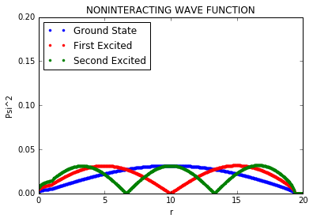
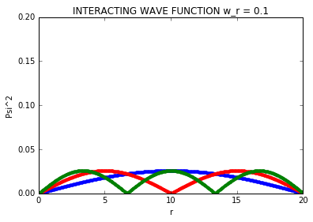

# Project 2: Solving the Schroedinger Equation Using Jacobi's Method
### Justin Byrne, Phy 480 Computational Physics, Michigan State University

## Introduction
	
   The Schrödinger equation is the fundamental equation of physics for describing quantum mechanical behavior. It is also often called the Schrödinger wave equation, and is a partial differential equation that describes how the wavefunction of a physical system evolves over time. In this project we disuss the methods of solving the schoedinger equation with application to systems of one and two electrons in a three-dimensional harmonic oscillator with and without a repulsive Coulomb interaction. This can be done by reformulating it in a discretized formas as an eigenvalue equation. With the use of some mathematical and coding tricks we can solve this easily. The algorithm will involve Jacobi's Method over many iterations.
   
The theory that lies at the heart of Jacobi's Algorithm is the similarity transformation. We apply an n-dimensional rotational matrix about an arbitrary angle. The goal is to choose this angle daftly such that the non-diagonal elements approach zero.
###### Cosider a matrix A:
   1.  Determine some tolernce limit $\\epsilon$
   2.  Pick out the largest Off(A) -> $Off(A)_{max}$.  If there is no largest element, that is that there are elements which are equally large then chose the element with lowest row index, if this is not sufficient then further chose the lowest column index.
   3.  Apply the similarity transformation to obtain an equation.  Chose $\theta$ such that $Off(A)_{max} = 0$
   4.  Sum $Off(A)$ to ensure that $\sqrt{\sum\limits_{i=1}^{n}\sum\limits_{j=1,j\neq i}^{n} Off(A)^2}\leq \epsilon$
   5.  Iterate this process until the condition in step 4 is satisfied.
    
    I chose to accomplish step 4 by imposing the slightly more stringent condition
    $\sqrt{(n^2 - n)(Off(A)_{max})^2}\leq \epsilon$.
    This condition is equivalent to assuming that all off-diagonal elements have a value equal to $Off(A)_{max}$.
    
   We diagonalize the matrix to easily deduce what the the eigenvalues are due to them being equal to the diagonal elements. This is where the Jacobi method comes into use. This allows us to make a series of "guesses" as to what the diagonal elements are and solve. Using these we can continuosly use the solutions to solve for the diagonals, each time becomming closer to what the true values are. This will take many iterations and after the non-diagonal values approach zero we are left to presume that the diagonal values are accurate. These iterations are done through the use of a transformation matrix. It is important to note that a similarity transformation, though it does change the eigen vectors has no effect on the eigen values.
   To implement Jacobi's method we need to apply the similarity transformation using a matrix S. We construct the specific form of S by first initializing an identity matrix. We then replace the appropriate elements with cos(θ) and sin(θ). This matrix must perform a rotation about some axis. We chose this axis based on which elements we are trying to bring to zero. An example of a 3-D rotation matrix is given below. We will then construct the matrix B via similarity transformation with S.
   $\hspace{3.0cm}\textbf{S}=
    \begin{bmatrix}
    1  & 0 & 0  \\
    0 &  cos(\theta) & -sin(\theta)  \\
    0  & sin(\theta) &  cos(\theta)  \\
    \end{bmatrix}\hspace{5.0cm}\textbf{B} = \textbf{S}^{-1} \textbf{AS}$
    
   Before we can create a program we must also know what the form of S must necessarily be (corresponding to the rotational axis), and how we find the rotational angle \theta.
   
   Working out simple similarity transformations by hand quickly reveals that certain elements surrounding the target are also relevent in determing the value of the target spot in the resulting matrix B. Let the target element now have indices k & l so that a⊙=akl. The corresponding element in B is then bkl=0. Using a combination of these notations we can yet again recast the matrix A.
$\hspace{8.0cm}\textbf{A}= 
\begin{bmatrix} 
a{kk} & a{\odot} & . \ a{lk} & a{ll} & . \ . & . & . \\ 
\end{bmatrix}$

Now that we have a procedure for finding S we need to examine how the trigfunctions of S interact with the elements of interest in A. Carrying out the multiplication results in an equation for the transformed target element in matrix B.
To evaluate the relationship between the transformation matrix and the corresponding rotation angle we can begin by using the Givens rotation matrix as a model.
\begin{equation}
tan\theta = t = \frac{s}{c} = G(i,j,0) = 
\end{equation}
\begin{bmatrix}
1  &  0 & 0  \\
0  &  c & s  \\
0  & -s & c \\
\end{bmatrix}

\begin{equation}
a' = GAG^T
\end{equation}
\begin{equation}
a'_{kl}=a'_{lk}=0 \Rightarrow a'_{kl}=(c^2-s^2)a_{kl} + sc(a_{kk}-a_{ll})=0
\end{equation}
Using the double-angle formula we can simplify: 
\begin{equation}
cos(2\theta)a_{kl}+\frac{1}{2}sin(2\theta)(a_{kk}-a_{ll})=0 \\
\theta = \frac{1}{2}tan^{-1}(\frac{2a_{kl}}{a_{kk}-a_{ll}})
\end{equation}

The arctangent function is bounded \begin{equation} \frac{−pi}{4}≤arctan(θ)≤\frac{pi}{4} \end{equation}. The factor of one half fixes the maximum value attainable in our algorithm at \begin{equation} θ=\frac{π}{4} \end{equation}

#### EigenValues and EigenVectors
   Similarity transformations have the property that they perserve the eigenvalues.  The eigenvectors however, are not preserved.  Luckily the nature of the transformation makes it easy to relate the new eigenvectors to the eigenvectors of your original matrix.
   We start with a matrix $\textbf{A}$ on which we apply our transformation matrix $\textbf{S}$ to obtain $\textbf{B} = \textbf{SA}\textbf{S}^{-1}$.  Consder $\vec{v}$, and eigen vector of $\textbf{A}$ with eigen value \lambda.  Let us define a new eigen vector $\vec{u}$ = $\textbf{S}\vec{v}$.  Now let us examine the properties of this new vector.
   If I apply $\textbf{B}$ onto $\vec{u}$ I get $B\vec{u} = \textbf{SA}\textbf{S}^{-1}\textbf{S}\vec{v}$.  The S and S inverse cancel to give me unity.  Because $\vec{v}$ is an eigen vector of $\textbf{A}$ I am left with $\lambda\textbf{S}\vec{v} = \lambda\vec{u}$. This means that $\vec{u}$ is an eigenvector of $\textbf{B}$.  We also now have a method for relating the two eigen vectors, namely
    $$\vec{v} = \textbf{S}^{-1}\vec{u}$$
    Once we are finished finding the eigen vectors of our transformed matrix, which are trivial since it is diagonal.  We can obtain our original eigen vectors by way of this transformation.


```python
#Program the solution for 3X3 matrix outlined in section 7.4 of the lecture notes.

import numpy as np
import math 

#Set iteration count = 0
step_number = 0

#Specify the tolerence limit (step 1).
epsilon = 10**(-8)
#Initialize the matrix
A = np.array([[1.0, 0.5, 0.0],
             [0.5, 2.0, 0.5],
             [0.0, 0.5, 3.0]])
n = A.shape[0] #get the number of rows in the matrix

print("Python gives the Eigenvalues as :",np.linalg.eigh(A)[0],
      "\nDo these agree with our results?\n")

#Locate the indices largest off-diagonal element (step2).
def OffA_max(in_matrix):
    mask = np.ones(in_matrix.shape, dtype=bool)
    np.fill_diagonal(mask, 0)
    indices = np.where(np.absolute(in_matrix) == np.absolute(in_matrix[mask]).max())
    global i_max; global j_max
    i_max = indices[0][0] 
    j_max = indices[1][0]
    global offA_max
    offA_max = in_matrix[i_max][j_max]

OffA_max(A)

#Determine theta & calculate sin/cos
theta=abs(0.5*math.atan(2*A[i_max][j_max]/(A[i_max][i_max]-A[j_max][j_max])))
c = math.cos(theta)
s = math.sin(theta)

#Construct matrix S (step 3)
S = np.zeros(A.shape, dtype=float)
np.fill_diagonal(S, 1)
S[i_max][i_max] = S[j_max][j_max] = c
S[i_max][j_max] = s
S[j_max][i_max] = -s
#Calculate the transpose of S
S_t = np.matrix.transpose(S)

#Multiply out the matricies 
S_tA = np.dot(S_t,A)
B = S_tAS = np.dot(S_tA,S)
A = S_tAS
OffA_max(A)
step_number = step_number + 1
S_net = S

#While loop conditional (step 5)
while (math.sqrt(n**2-n)*abs(offA_max) >= epsilon):
    #Determine theta & calculate sin/cos
    theta=abs(0.5*math.atan(2*A[i_max][j_max]/(A[i_max][i_max]-A[j_max][j_max])))
    c = math.cos(theta)
    s = math.sin(theta)

    #Construct matrix S (step 3)
    S = np.zeros(A.shape, dtype=float)
    np.fill_diagonal(S, 1)
    S[i_max][i_max] = S[j_max][j_max] = c
    S[i_max][j_max] = s
    S[j_max][i_max] = -s
    #Calculate the transpose of S
    S_t = np.matrix.transpose(S)

    #Multiply out the matricies 
    S_tA = np.dot(S_t,A)
    B = S_tAS = np.dot(S_tA,S)
    A = S_tAS
    S_net = np.dot(S,S_net)
    OffA_max(A)
    
    step_number = step_number + 1

#Print off A and the eigenvalues
print("Similarity Transformed Matrix:\n",A,"\n")
print("EigenValues:",end=" ")
i=0
while (i < n-1): 
    print(np.diagonal(A)[i],end=", ")
    i=i+1
print(np.diagonal(A)[i])
print("Number of iterations:", step_number)

#Build Eigenvectors of B and store them as columns in a matrix
Eigen_vectorB = np.zeros([n])
Eigen_vectorB.shape=(n,1)
Eigen_vectorB[i]=1
Eigen_matrixA=np.dot(S_net,Eigen_vectorB)
i=1
while (i < n):
    Eigen_vectorB = np.zeros([n])
    Eigen_vectorB.shape=(n,1)
    Eigen_vectorB[i]=1
    Eigen_vectorA=np.dot(S_net,Eigen_vectorB)
    Eigen_matrixA=np.hstack((Eigen_matrixA,Eigen_vectorA))
    i=i+1
def column(matrix, i):
    return [row[i] for row in matrix]

#Pick an eigenvector (column k) out of your matrix
#k = Eigenvector number - 1; For 3X3 k(0:2) 
k=2
nthEigen_valueA=column(Eigen_matrixA,k)
print("\n","Eigenvector",k+1,"of matrix A:\n",nthEigen_valueA)
```

    Python gives the Eigenvalues as : [ 0.77525513  2.          3.22474487] 
    Do these agree with our results?
    
    Similarity Transformed Matrix:
     [[  3.22474487e+00  -5.90510645e-16   2.61630587e-10]
     [  2.01124881e-17   7.75255129e-01   2.11758237e-22]
     [  2.61630254e-10  -1.40980164e-17   2.00000000e+00]] 
    
    EigenValues: 3.22474487139, 0.775255128608, 2.0
    Number of iterations: 35
    
     Eigenvector 3 of matrix A:
     [0.90826790668672297, 0.037566931209501352, -0.41669909450635934]
    

### Applying Jacobi's Method to Our Simple System: Higher Resolution
Now, to check that A has been constructed correctly we can run python's code at higher resolution using the cell below. You can check for yourself that as we up the resolution the values we get approach our predicted values.


```python
import numpy as np
import math

#Set up our step number and bounds
n = 2000
P_min = 0
P_max = 10
h = (P_max-P_min)/n

#Initialize vector V
V=np.zeros([n+1])
#Build vector V
i = 1
while (i < n):
    V[i] = (P_min+ i*h)**2
    i+=1
V[n] = (P_max)**2

#Create the matrix for the Schrodinger Equation
e_n = 1/h**2 #only do this computation once
A_row1=np.zeros([n-2]);A_row1[0]=2*e_n+V[1];A_row1[1]=-e_n
#Initialize Matrix A
A=A_row1
#Build Matrix A
i=2
while (i<n-2):
    A_next=np.zeros([n-2]);A_next[i-2]=A_next[i]=-e_n
    A_next[i-1]=2*e_n+V[i]
    A=np.vstack((A,A_next))
    i+=1
A_last=np.zeros([n-2]);A_last[i-2]=-e_n
A_last[i-1]=2*e_n+V[i]
A=np.vstack((A,A_last))

print("Python's Eigen Values:",np.linalg.eigh(A)[0][0],np.linalg.eigh(A)[0][1],np.linalg.eigh(A)[0][2])
print("\n\nError = ABS(Predicted_Value - Python's_Value)")
print("Error in First Eigen Value:",abs(3-np.linalg.eigh(A)[0][0]))
print("Error in Second Eigen Value:",abs(7-np.linalg.eigh(A)[0][1]))
print("Error in Third Eigen Value:",abs(11-np.linalg.eigh(A)[0][2]))
```

    Python's Eigen Values: 2.99999218748 6.99996093727 10.9999046867
    
    
    Error = ABS(Predicted_Value - Python's_Value)
    Error in First Eigen Value: 7.81252379811e-06
    Error in Second Eigen Value: 3.90627263025e-05
    Error in Third Eigen Value: 9.53133358923e-05
    

## Results

|$\rho_{max}$ = 10 | $E_1$      | $E_2$        | $E_3$     | Max Error|
   |:-----------------|:----------:|:------------:|:---------:|:---------|
   | n = 10           |    2.68672 |     6.11300  |  11.05735 |  0.88699 |
   | n = 100          |    2.99687 |     6.98434  |  10.96174 |  0.03826 |
   | n = 1000         |    2.99997 |     6.99984  |  10.99962 |  0.00038 |
   | n = 2000        |     2.99999 |     6.99996  |  10.99990 |  9.53133e-05|
   
### Adding Interactions
To make our analysis more realistic we must also consider the fact that the two electrons interact.  Mathematically, this interaction manifests itself simply as a change in the potential term.  Before we had $V_i = \rho^2$, this becomes $V_i = \omega_r\rho^2+1/\rho$.  In order to solve this problem we can simply reimplement the code we used earlier.  The prompt requests that we investigate $\omega_r=0.01, \omega_r=0.5, \omega_r=1$, and $\omega_r=5$.


```python
'''
The Folowing Code is Essentially identical to that in section 2.0.  
The only difference is the correction to the potential and the iteration over w_r
'''

#Set oscillator potential (w_r)
w_r=[.01,0.5,1.0,5.0]
import numpy as np
import math
#step size must be small due to old laptop :(
#It took me 4 hours to figure this out....

#Set up our step number and bounds
n = 10
P_min = 0
P_max = 10
h = (P_max-P_min)/n

#loop over values of w_r
k=0
while k <= 3:
    #Initialize vector V
    V=np.zeros([n+1])
    #Build vector V
    i = 1
    while (i < n):
        V[i] = w_r[k]**2*(P_min+ i*h)**2 + 1/(P_min+ i*h)
        i+=1
    V[n] = (P_max)**2

    #Create the matrix for the Schrodinger Equation
    e_n = 1/h**2 #only do this computation once
    A_row1=np.zeros([n-2]);A_row1[0]=2*e_n+V[1];A_row1[1]=-e_n
    #Initialize Matrix A
    A=A_row1
    #Build Matrix A
    i=2
    while (i<n-2):
        A_next=np.zeros([n-2]);A_next[i-2]=A_next[i]=-e_n
        A_next[i-1]=2*e_n+V[i]
        A=np.vstack((A,A_next))
        i+=1
    A_last=np.zeros([n-2]);A_last[i-2]=-e_n
    A_last[i-1]=2*e_n+V[i]
    A=np.vstack((A,A_last))

    #Carry out the transformation
    #Locate the indices largest off-diagonal element (step2).
    def OffA_max(in_matrix):
        mask = np.ones(in_matrix.shape, dtype=bool)
        np.fill_diagonal(mask, 0)
        indices = np.where(np.absolute(in_matrix) == np.absolute(in_matrix[mask]).max())
        global i_max; global j_max
        i_max = indices[0][0] 
        j_max = indices[1][0]
        global offA_max
        offA_max = in_matrix[i_max][j_max]

    OffA_max(A)

    #Determine theta & calculate sin/cos
    theta=abs(0.5*math.atan(2*A[i_max][j_max]/(A[i_max][i_max]-A[j_max][j_max])))
    c = math.cos(theta)
    s = math.sin(theta)

    #Construct matrix S (step 3)
    S = np.zeros(A.shape, dtype=float)
    np.fill_diagonal(S, 1)
    S[i_max][i_max] = S[j_max][j_max] = c
    S[i_max][j_max] = s
    S[j_max][i_max] = -s
    #Calculate the transpose of S
    S_t = np.matrix.transpose(S)

    #Set iteration count = 0
    step_number = 0
    #Multiply out the matricies 
    S_tA = np.dot(S_t,A)
    B = S_tAS = np.dot(S_tA,S)
    A = S_tAS
    OffA_max(A)
    step_number = step_number + 1
    S_net = S

    #Specify the tolerence limit (step 1).
    epsilon = 10**(-2)
    #While loop conditional (step 5)
    while (abs(offA_max) >= epsilon):
        #Determine theta & calculate sin/cos
        theta=abs(0.5*math.atan(2*A[i_max][j_max]/(A[i_max][i_max]-A[j_max][j_max])))
        c = math.cos(theta)
        s = math.sin(theta)

        #Construct matrix S (step 3)
        S = np.zeros(A.shape, dtype=float)
        np.fill_diagonal(S, 1)
        S[i_max][i_max] = S[j_max][j_max] = c
        S[i_max][j_max] = s
        S[j_max][i_max] = -s
        #Calculate the transpose of S
        S_t = np.matrix.transpose(S)

        #Multiply out the matricies 
        S_tA = np.dot(S_t,A)
        B = S_tAS = np.dot(S_tA,S)
        A = S_tAS
        S_net = np.dot(S,S_net)
        OffA_max(A)
    
        step_number = step_number + 1

    #Print off Iterations and Eigen Values
    print("\nNumber of iterations:", step_number)
    print("Our EigenValues w_r =",w_r[k],":\n",end=" ")
    i=0
    while (i < 3): 
        print(sorted(np.diagonal(A))[i],end=", ")
        i=i+1

    #Error Data as disagreement between my algorithm and python's solver
    print("\n\nError = ABS(My_Value - Python's_Value)")
    print("Error in First Eigen Value:",
          abs(sorted(np.diagonal(A))[0]-np.linalg.eigh(A)[0][0]))
    print("Error in Second Eigen Value:",
          abs(sorted(np.diagonal(A))[1]-np.linalg.eigh(A)[0][1]))
    print("Error in Third Eigen Value:",
          abs(sorted(np.diagonal(A))[2]-np.linalg.eigh(A)[0][2]))
    
    k=k+1
```

    
    Number of iterations: 151
    Our EigenValues w_r = 0.01 :
     0.357149487185, 0.781458183899, 1.35559449818, 
    
    Error = ABS(My_Value - Python's_Value)
    Error in First Eigen Value: 2.11970739805e-05
    Error in Second Eigen Value: 7.59940358219e-06
    Error in Third Eigen Value: 4.81067830473e-05
    
    Number of iterations: 97
    Our EigenValues w_r = 0.5 :
     2.14124557579, 3.68486126808, 4.89873969135, 
    
    Error = ABS(My_Value - Python's_Value)
    Error in First Eigen Value: 1.92508400461e-05
    Error in Second Eigen Value: 3.46032032721e-05
    Error in Third Eigen Value: 1.74194364302e-05
    
    Number of iterations: 71
    Our EigenValues w_r = 1.0 :
     3.6343342661, 6.65824567613, 11.3961005862, 
    
    Error = ABS(My_Value - Python's_Value)
    Error in First Eigen Value: 1.49958939488e-05
    Error in Second Eigen Value: 3.36084421537e-06
    Error in Third Eigen Value: 1.14314528901e-05
    
    Number of iterations: 44
    Our EigenValues w_r = 5.0 :
     27.9865786955, 102.505410711, 227.335627106, 
    
    Error = ABS(My_Value - Python's_Value)
    Error in First Eigen Value: 1.70775393826e-10
    Error in Second Eigen Value: 1.08847075353e-07
    Error in Third Eigen Value: 8.17459806512e-08
    

### Plotting the Wave Functions
I implement python's internal algorithm to calculate the eigenvectors, then I use them to generate my plots.
Again the code is essentially the same only with the addition of some lines for plotting and some lines for finding and organizing the eigenvalues for the different cases. I take all the eigenvectors for n=0,1,2 and store them in a multidimensional array called Waves. I then square all the elements of the eigenvectors and plot the result. The plots are color coded with the ground state and first two excited states. In order to see any state by itself simply comment out the appropriate line in the plotting section.//
//
### Plotting the Non-Interacting wave function


```python
import numpy as np
import math
#step size must be small due to old laptop :(
#It took me 4 hours to figure this out....

#Set up our step number and bounds
n = 2000
P_min = 0
P_max = 20
h = (P_max-P_min)/n

#Initialize vector V
V=np.zeros([n+1])
#Build vector V 
i = 1
while (i < n):
    V[i] = (P_min+ i*h)**2
    i+=1
V[n] = (P_max)**2

#Create the matrix for the Schrodinger Equation
e_n = 1/h**2 #only do this computation once
A_row1=np.zeros([n-2]);A_row1[0]=2*e_n+V[1];A_row1[1]=-e_n
#Initialize Matrix A
A=A_row1
#Build Matrix A
i=2
while (i<n-2):
    A_next=np.zeros([n-2]);A_next[i-2]=A_next[i]=-e_n
    A_next[i-1]=2*e_n+V[i]
    A=np.vstack((A,A_next))
    i+=1
A_last=np.zeros([n-2]);A_last[i-2]=-e_n
A_last[i-1]=2*e_n+V[i]
A=np.vstack((A,A_last))

print("Python's Eigen Values:"
      ,np.linalg.eigh(A)[0][0],np.linalg.eigh(A)[0][1],np.linalg.eigh(A)[0][2])

#Prepare for Plotting!
Psi_0=np.linalg.eigh(A)[1][0]
Psi_1=np.linalg.eigh(A)[1][1]
Psi_2=np.linalg.eigh(A)[1][2]
Waves=[Psi_0,Psi_1,Psi_2]

j=0
while j<3:
    k=0
    while k < 3:
        Waves[j][k]=Waves[j][k]**2
        k=k+1
    j=j+1

#Initialize vector r
r=np.zeros([n-2])
i = 2
while (i < n):
    r[i-2] = (P_min + i*h)
    i+=1

#Plotting
from pylab import *
import matplotlib.pyplot as plt
%matplotlib inline
xlabel("r")
ylabel("Psi^2")
axes = plt.gca()
axes.set_xlim([0,20.0])
axes.set_ylim([0,0.2])
title("NONINTERACTING WAVE FUNCTION")
#You can comment out some of there lines if you wish.
plt.plot(r,Waves[0],'b.',label="Ground State")
plt.plot(r,Waves[1],'r.',label="First Excited")
plt.plot(r,Waves[2],'g.',label="Second Excited")
plt.legend(loc='upper left')
#Suppress output from plotting section
print("")
```

    Python's Eigen Values: 2.99996874965 6.99984374645 10.9996187367
    
    





### Plotting: Interacting Wave-Function


```python
#Set oscillator potential (w_r)
w_r=0.1
import numpy as np
import math
#step size must be small due to old laptop :(
#It took me 4 hours to figure this out....

#Set up our step number and bounds
n = 3000
P_min = 0
P_max = 20
h = (P_max-P_min)/n

#loop over values of w_r
#Initialize vector V
V=np.zeros([n+1])
#Build vector V
i = 1
while (i < n):
    V[i] = w_r**2*(P_min+ i*h)**2 + 1/(P_min+ i*h)
    i+=1
V[n] = (P_max)**2

#Create the matrix for the Schrodinger Equation
e_n = 1/h**2 #only do this computation once
A_row1=np.zeros([n-2]);A_row1[0]=2*e_n+V[1];A_row1[1]=-e_n
#Initialize Matrix A
A=A_row1
#Build Matrix A
i=2
while (i<n-2):
    A_next=np.zeros([n-2]);A_next[i-2]=A_next[i]=-e_n
    A_next[i-1]=2*e_n+V[i]
    A=np.vstack((A,A_next))
    i+=1
A_last=np.zeros([n-2]);A_last[i-2]=-e_n
A_last[i-1]=2*e_n+V[i]
A=np.vstack((A,A_last))
print("Python's Eigen Values for w_r =",
    w_r,":",np.linalg.eigh(A)[0][0],np.linalg.eigh(A)[0][1],np.linalg.eigh(A)[0][2])
    
#Prepare for Plotting!
Psi_0=np.linalg.eigh(A)[1][0]
Psi_1=np.linalg.eigh(A)[1][1]
Psi_2=np.linalg.eigh(A)[1][2]
Waves=[Psi_0,Psi_1,Psi_2]

j=0
while j<3:
    k=0
    while k < 3:
        Waves[j][k]=Waves[j][k]**2
        k=k+1
    j=j+1

#Initialize vector r
r=np.zeros([n-2])
i = 2
while (i < n):
    r[i-2] = (P_min + i*h)
    i+=1

#Plotting
from pylab import *
import matplotlib.pyplot as plt
%matplotlib inline
xlabel("r")
ylabel("Psi^2")
axes = plt.gca()
axes.set_xlim([0,20.0])
axes.set_ylim([0,0.2])
title("INTERACTING WAVE FUNCTION w_r = 0.1")
#You can comment out some of there lines if you wish.
plt.plot(r,Waves[0],'b.',label="Ground State")
plt.plot(r,Waves[1],'r.',label="First Excited")
plt.plot(r,Waves[2],'g.',label="Second Excited")
#Suppress output from plotting section
print("")
```

    Python's Eigen Values for w_r = 0.1 : 0.598798464652 0.968297311379 1.34671751147
    
    





#### Interacting Wave Functions
|$\rho_{max}$ = 10 |  |
   |:-----------------|-----------:|
   | n = 100          |  |
   #### Interacting
   |$\rho_{max}$ = 20 | w_r = 15  | w_r = 10    | w_r = 5.0 | w_r = 0.1|
   |:-----------------|:----------:|:------------:|:---------:|:---------|
   | n = 100          |  |  |   |   |
   
   If you look at the plots you will notice that all of the wave functions have the correct number of nodes. I think that this provides evidence that my analysis is correct and that my code returns meaningful results. We can see that over the distance I have allowed the wave funciton to live in, contrary to intuition, the interaction term actually squeezes the wave funciton!! 
   
   
## Conclusion
We can see in the plots above that small values of w_r allow our wave to spread out a little more. For w_r=0.5 the plot acutally looks very similar to the noninteracting case. However, as we amp up w_r the wave functions become more and more compressed.
This project made it very clear that both Schrodinger's and Heisenberg's formulation of quantum mechanics are indeed equivalent. The properties viewed in the different energy levels could be attributed to quantum confinement, further proving Heisenberg's uncertainty principle.


```python

```
